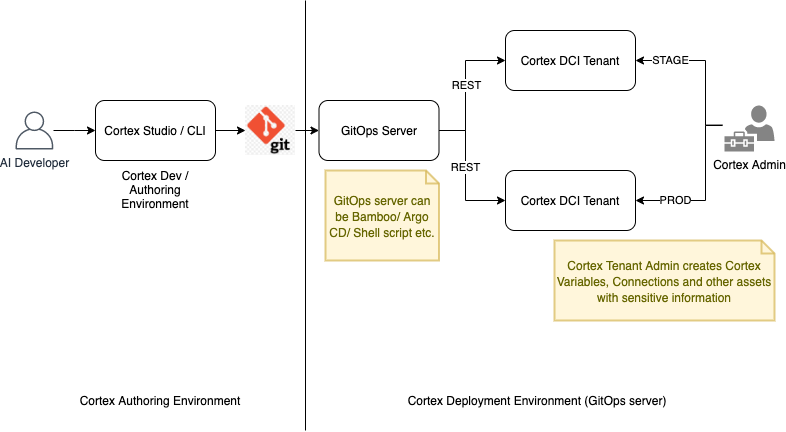

# GitOps Tool for Fabric
CLI tool for deploying Cortex assets in an automated CI/CD pipeline. Cortex assets need to be snapshot & export using [cortex-cli](https://www.npmjs.com/package/cortex-cli). This will generate Cortex assets export and manifest file to drive deployment.

#### Working with SSL certs issued by internal CAs
Download SSL cert from Cortex DCI to add as trusted: `fabric fetchCert <Cortex DCI URL> </path/to/save/cert.pem>`
Add downloaded cert as trusted one: Set environment variable `SSL_CERTS_DIR` to directory where cert is downloaded

#### Prerequisites
* [cortex](https://www.npmjs.com/package/cortex-cli) (follow instruction on link to install CLI)
* This tool [fabric](https://github.com/CognitiveScale/fabric-ops/releases/). Download OS specific binary and add to system path or bin directory for system wide global access (or execute binary with full path)
* See usage examples of both the tools above in [script](scripts)

#### Cortex Application Lifecycle
1. **Authoring**: Create Skills, Connections, Datasets and compose Agent(s) using Cortex Studio and [CLI](https://www.npmjs.com/package/cortex-cli) 
2. **Export**:
    * Snapshot & export agent(s): see `export_agents` in usage example script
    * Execute `export_agents` in Git repo (of Cortex Skills/Actions) checkout and push exported assets (`.fabric` directory with snapshots and `fabric.yaml` manifest file to drive deployment)
3. **Deploy** (GitOps)
    * Execute `fabric <Git Repo checkout directory>` 
> 1 & 2 are using `cortex-cli` and 3 is using `fabric` 

    
### Cortex Assets CI/CD flow
##### Authoring (using `cortex-cli`)
See usage example script for `setup`, `setup_project` and `export_agents`

##### Deployment (`fabric` this tool)
###### Inputs
* Git repo checkout folder with manifest file fabric.yaml and .fabric folder containing Cortex artifacts at top level directory (as setup in previous section) 
* This implementation depends and `Docker` daemon running on host machine
* Environment variables 
    For Docker image builds (for Cortex Action)
    *  `DOCKER_PREGISTRY_PREFIX` Docker image namespace. This will be same for all actions in theGit repo.
    *  `DOCKER_PREGISTRY_URL` Docker private registry URL
    *  `DOCKER_BUILD_CONTEXT`  Allowed values `DOCKERFILE_CURRENT_DIR | DOCKERFILE_PARENT_DIR | REPO_ROOT | </path/relative/to/repo>`. This config directs which directory to copy (build context) in Docker image building
    
    For Cortex DCI v5
    *  `CORTEX_URL` Cortex DCI API base URL
    *  `CORTEX_ACCOUNT`
    *  `CORTEX_TOKEN` 
    *  `CORTEX_USER`
    *  `CORTEX_PASSWORD` 
    > Either token or user+password is required
    
    For Cortex DCI v6
    * `CORTEX_ACCESS_TOKEN_PATH` Path of `cortex-token.json` downloaded from Cortex console `Settings`
    * `CORTEX_PROJECT`

Set environment variables and run `fabric <Git repo directory>` to deploy all Cortex assets exported in previous Authoring step. This command will:
* Scan Git repo directory recursively for Dockerfile(s)
* Build & tag Docker images with configured build context, namespace and git version (commit hash pointing to HEAD)
* Push built Docker image to configured Docker registry

* Parse manifest `fabric.yaml` to get Cortex artifacts to be deployed
* Deploy agent, skill, action, datasets and agent snapshots. connection and variables will be in next iteration with Vault integration, because we need to handle secrets
* Action deployment need to substitute image with newly build (namespace, registry url, version change etc). for substitution action name in `skill.yaml` and `action deploy` must be Docker image name.

> The action name and the Docker image name a to be directory name of Dockerfile. This is the only convention need to be followed in Git repo.

##### `fabric` Usage:

See usage in [generated doc](doc/fabric_usage.md)

When trying to deploy to Cortex, we need to login to the private registry using the following command. Do this only if the Docker private registry is managed by DCI. For external Docker registry do `docker login` on host machine.
> `fabric dockerAuth $DOCKER_PREGISTRY_URL 'cli' $CORTEX_TOKEN`

For end-to-end deployment use `fabric` command as
>  `fabric <Git repo directory>`

Each step of end-to-end deployment can be executed individually for finer control over deployment, as described below:

1. Build & push Cortex Actions Docker images
If user is managing Docker images in the registries manually, then use this command to build and push. This can be useful in scenarios like, same Docker registry is shared with all DCIs (dev, stage, prod) or Docker images are replicated to all DCIs using tools like [skopeo](https://github.com/containers/skopeo) 
>  `fabric build <Git repo directory>`

2. Deploy Cortex resources as per manifest
>  `fabric deploy <Git repo directory>`

> Note: executing `build` and `deploy` separately will point to Docker registry from which Cortex assets were snapshot & exported.
 
##### Development Setup 
* Install (Go >1.15](https://golang.org/dl/)
* Checkout this repo and open in IDE
* Install dependencies (IDE will do automatically from go.mod)
    *  This CLI app is built using [Cobra](https://github.com/spf13/cobra)
* Using `Makefile` to manage project. `make clean build docgen` will clean & build binaries for OSX (darwin), Linux & Windows. Also generate cmd usage document in markdown format 

##### Next Steps
* Support creating Cortex Connections. Need to handle secret credentials
* Fetch Cortex credentials from Vault, instead of environment variables 
